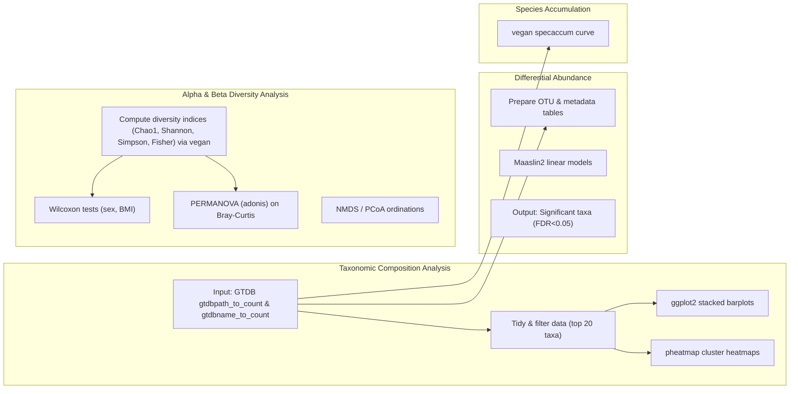

# Taxonomy Analysis Pipeline

```mermaid
flowchart LR
    subgraph Taxonomic_Composition["Taxonomic Composition Analysis"]
        T1["Input: GTDB gtdbpath_to_count & gtdbname_to_count"]
        T2["Tidy & filter data (top 20 taxa)"]
        T3["ggplot2 stacked barplots"]
        T4["pheatmap cluster heatmaps"]
    end

    subgraph Alpha_Beta_Diversity["Alpha & Beta Diversity Analysis"]
        A1["Compute diversity indices (Chao1, Shannon, Simpson, Fisher) via vegan"]
        A2["Wilcoxon tests (sex, BMI)"]
        A3["PERMANOVA (adonis) on Bray-Curtis"]
        A4["NMDS / PCoA ordinations"]
    end

    subgraph Differential_Abundance["Differential Abundance"]
        D1["Prepare OTU & metadata tables"]
        D2["Maaslin2 linear models"]
        D3["Output: Significant taxa (FDR<0.05)"]
    end

    subgraph Species_Accumulation["Species Accumulation"]
        S1["vegan specaccum curve"]
    end

    T1 --> T2 & D1 & S1
    T2 --> T3 & T4
    A1 --> A2 & A3
```
